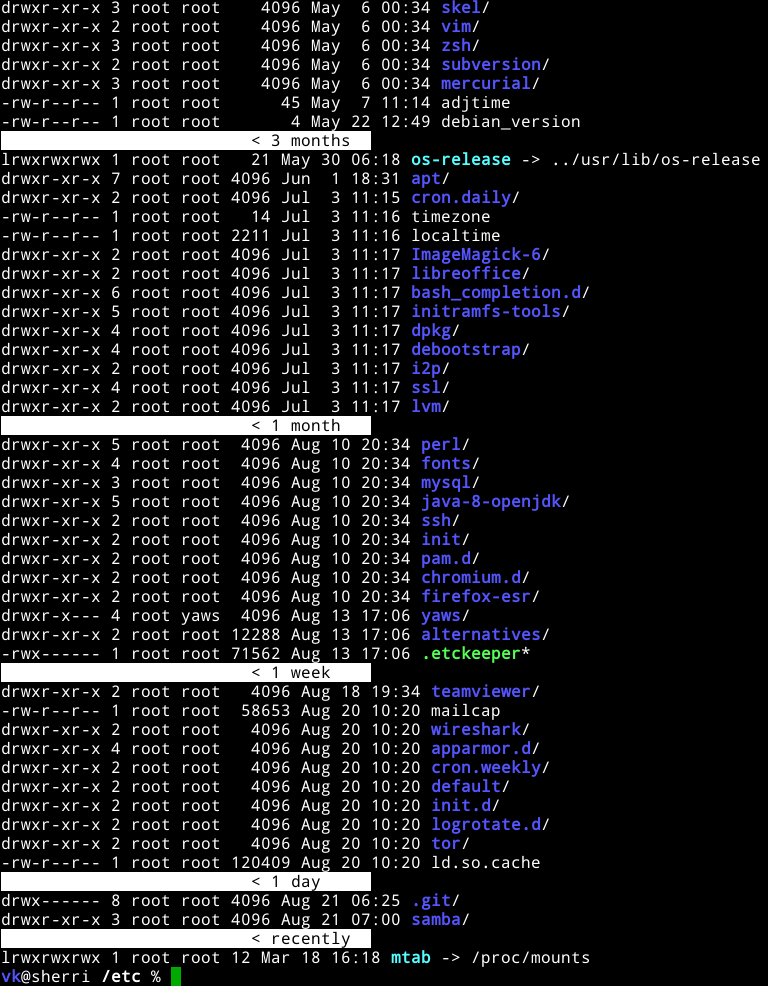

* vkl - a better "ls"-experience

This Python script is a wrapper for the GNU/Linux ~ls~-tool for simple
cases. To be precise, it's a substitute (only) for the following command:

: ls -lt --all --reverse --directory --classify --color=auto

In contrast to the standard ~ls~ output, this script visualizes time
in a much better way:

Normal ~ls~ command is listing all files without proper way to
visualize brand-new, new, old, and very old files. By introducing
horizontal bars that sub-divide the output in a pseudo-logarithmical
way, the user gets a *much better feeling on the age* of the items in
the current directory.

- *Target group*: users of a GNU/UNIX command line or similar
- Hosted on github: https://github.com/novoid/vkl

By the way: yes, I tried to get this functionality to the GNU project
to be included to ~ls~. I failed miserably. To me, they don't seem to
add such features for many years. Very conservative :-(

** Installation

Get it from [[https://github.com/novoid/vkl][GitHub]] or install it via «pip install vkl».

# --- BEGIN SHARED: 0dependencies --- see https://github.com/novoid/screencasts/
[[https://0dependencies.dev][https://0dependencies.dev/0dependencies.svg]] → [[https://0dependencies.dev/][learn more about 0dependencies]]
# --- END SHARED: 0dependencies --- see https://github.com/novoid/screencasts/  

** Usage

#+BEGIN_SRC sh :results output :wrap src
vkl --help
#+END_SRC

#+BEGIN_src
usage: vkl [-h] [-l] [-m | -c | -a] [-p] [-d DELEGATE] [--debug] [--version]

vkl lists the current directory's contents sorted by time and grouped into pseudo-logarithmic age classes (recently, 1 hour, 1 day, 1 week, 1 month, ...) — a visualization GNU ls does not provide.

Homepage: https://github.com/novoid/vkl

options:
  -h, --help            show this help message and exit
  -l, --log             displays directory content by a pseudo logarithmic
                        time (default option)
  -m, --mtime           sort items using modification time (default option)
  -c, --ctime           sort items using change time
  -a, --atime           sort items using access time
  -p, --primitivels     use primitive output of directory rather than using
                        GNU ls
  -d, --delegate DELEGATE
                        delegate additional arguments to ls command; for
                        values starting with a dash use "=", e.g.
                        --delegate="-la"
  --debug               enable (senseless) debug output
  --version             display version and exit

:copyright: (c) 2010-now by Karl Voit <tools@Karl-Voit.at>
:license: GPL v3 or any later version
:URL: https://github.com/novoid/vkl
:bugreports: via github or <tools@Karl-Voit.at>
:version: 2026-07-16
·
#+END_src

Examples:

: vkl
... the simplest case, sorted by modification time

: vkl -c
... sorted by change time

: vkl -p
... using its own (primitive, self-written) output to circumvent output issues or to use it on non-GNU/UNIX system

* How to Thank Me and Contribute to the Project
# --- BEGIN SHARED: how_to_thank_me --- see https://github.com/novoid/screencasts/

I'm glad if you like my tool. I've got way more projects on:

- [[https://github.com/novoid/][GitHub]] (oldest projects),
- [[https://gitlab.com/publicvoit/][GitLab.com]] (older projects), and
- [[https://codefloe.com/publicvoit/][CodeFloe]] (newest projects).

If you want to support me:

- [[https://karl-voit.at/2018/06/07/cardware/][Send old-fashioned *postcard* per snailmail]] - I love personal feedback!
  - see [[http://tinyurl.com/j6w8hyo][my address]]
- Send feature wishes or improvements as an issue 
- Create issues for bugs
- Contribute merge requests for bug fixes
- Check out my other cool projects on the platforms above

If you want to contribute to this cool project, please fork and
contribute!

I am using [[http://www.python.org/dev/peps/pep-0008/][Python PEP8]] and occasionally some ideas from [[http://en.wikipedia.org/wiki/Test-driven_development][Test Driven
Development (TDD)]]. I fancy Python3 with [[https://typing.python.org/en/latest/spec/annotations.html][type annotations]], although I'm
not using them everywhere at the moment. Starting with 2025, I began
to use help from Claude.ai which is a huge improvement, given my lack
of programming practice and knowledge.

After all, each of my tools was developed because I needed its
functionality and could not get it elsewhere - at least to my
knowledge or taste.

# --- END SHARED: how_to_thank_me --- see https://github.com/novoid/screencasts/

* Local Variables                                                  :noexport:
# Local Variables:
# mode: auto-fill
# mode: flyspell
# eval: (ispell-change-dictionary "en_US")
# End:
